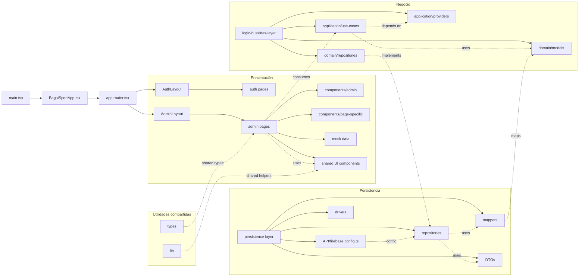

# Sistema Web de Gestión de Inventario y Ventas para Tiendas de Calzados

¡Hola! Soy desarrollador de software y estoy por crear un sistema de gestión de inventario y ventas para tiendas de calzado. Este sistema está pensado para ser sencillo y robusto, garantizando que el cliente no tenga errores y la aplicación sea óptima y de buen performance.

## Resumen ejecutivo del proyecto

Este proyecto busca construir una solución web para la administración completa de una tienda de calzados, enfocada en:

- control de inventario por talla y stock mínimo,
- gestión de ventas, compras y cuentas por cobrar,
- visualización de reportes y dashboard,
- notificaciones para tareas críticas como vencimientos y reabastecimientos,
- una interfaz clara y rápida para que el dueño del negocio pueda operar sin complicaciones.

Desde el punto de vista de desarrollo, este documento sirve como guía para entender:

- qué funcionalidades debe cubrir la aplicación,
- cómo está organizada la arquitectura actual,
- cuál será el flujo recomendado para implementar cada módulo,
- y cómo mantener una separación clara entre UI, lógica de negocio y persistencia.

---

## 1. Metodología de Desarrollo
Para llevar a cabo esta aplicación web de manera profesional, se implementará la siguiente metodología:

1. **Requerimientos del sistema.**
2. **Arquitectura y diseño de Software:** Esta fase constará de las siguientes subfases:
   * Diseño del sistema.
   * Patrón de Arquitectura a utilizar.
   * Diseño del Software.
   * Diseño de los módulos detallados del Software.
   * Evaluación de la Arquitectura de Software.
   * Documentación de la Arquitectura de Software.
3. **Implementación y Distribución de la aplicación web.**

### Tecnologías a Utilizar
* **Front-End:** React JS + TypeScript + shadcn UI + Zod + TanStack Query + Zustand.
* **Back-End / Base de Datos:** Firebase Auth + Firestore para datos principales, y Supabase Storage para imágenes de productos.
* **Arquitectura adicional:** contenedor de dependencias centralizado en `src/di/container.ts` para desacoplar la UI de la implementación concreta de repositorios.

### Roles de Usuario
Se utilizará un **solo tipo de rol de usuario**, que será el dueño de la tienda de calzados. Solo él se autenticará en el sistema utilizando su nombre, apellido, correo y contraseña.

---

## 2. Requerimientos de la Aplicación y del Sistema

### Módulo de Gestión Financiera y de Caja
* **Objetivo:** Centralizar el flujo de efectivo y garantizar la trazabilidad de cada ingreso y egreso del negocio. Podrá crear, editar y eliminar transacciones.
* **Registro de transacciones:** El usuario podrá registrar transacciones y gastos especificando el tipo:
  
  #### A. Si es de tipo "Venta" (Producto vendido):
  Se deberá llenar un formulario con los siguientes datos:
  * **Búsqueda de Calzado o producto:** Al seleccionar esta opción se despliega un modal con una lista de productos o calzados registrados en el inventario. Se debe seleccionar uno.
  * **Nombre del producto o calzado:** Si no se ha seleccionado un producto de la búsqueda, este campo estará vacío y debe llenarse manualmente; en caso contrario, se llenará automáticamente con el nombre del producto buscado.
  * **Método de pago:** Un Dropdown para escoger entre: Efectivo, Pago móvil, Punto de venta, USDT, Intercambio o Canje.
  * **Fecha de la venta:** Por defecto tendrá la fecha actual, pero el dueño puede establecerla manualmente.
  * **Cantidad por talla:** Campo para establecer cuántos calzados se vendieron y de qué tallas específicamente. Tendrá la opción de añadir o eliminar cantidades por talla (Ejemplo: `cantidad: 4, tallas: 28`, `cantidad: 3, tallas: 30`). IMPORTANTE: se debe descontar la cantidad de calzados del stock una vez realizada una venta, y alertar si algun calzado del stock llego al limite de stock minimo y cada venta debe mostrar cuanto fue el total tanto en dolares como en bolivares ( la cantidad de bolivares sera igual al la cantidad en dolares por la tasa establecidad por el usuario en la fecha dada es decir no debe calcularse en base a la tasa actual sino almacenar el valor en base a la tasa en la cual fue procesada la venta ).
  * **Descripción:** Breve descripción de la venta.
  * **Total de la venta:** Información basada en el cálculo automático del total de todas las cantidades de calzados por las tallas.
  * **Acción:** Opción de crear o registrar la transacción.

  #### B. Si es de tipo "Compra" (Producto comprado):
  El formulario cambiará a los siguientes campos:
  * **Nombre del Producto.**
  * **Método de Pago de la compra:** Efectivo, Pago móvil, Punto de venta, USDT, Intercambio o Canje.
  * **Fecha de la compra:** Por defecto la fecha actual, modificable manualmente.
  * **Total de la compra:** Input para ingresar el monto del costo de la compra.
  * **Descripción:** Breve descripción de la compra.
  * **Acción:** Opción para crear la transacción de tipo compra.

### Módulo de Control de Cuentas por Cobrar
* **Objetivo:** Permitir asignar saldos pendientes a clientes específicos, manteniendo el historial de abonos y deudas, y notificando cuando se llegue a la fecha límite de cobro.
* **Acciones:** Se podrá crear, editar y eliminar deudas.
* **Formulario de creación de deuda:**
  * **Buscar Cliente:** Despliega un modal con la lista de clientes creados.
  * **Nombre del cliente:** Si no se selecciona un cliente existente, se llena manualmente con el nombre del cliente o proveedor.
  * **Cargo o puesto del cliente:** Si no se seleccionó un cliente previo, se debe especificar su cargo o puesto.
  * **Fecha de cobro de la deuda:** Fecha límite en la cual el sistema emitirá una notificación.
  * **Abono de la deuda:** Cantidad que el cliente abona inicialmente (opcional, por defecto es 0).
  * **Total de la deuda:** Monto total a deber.
  * *Nota de guardado:* Si se establece un abono, se restará automáticamente del total antes de guardar en la base de datos.
* **Actualización de la deuda:** Al actualizar, el dueño podrá registrar nuevos abonos. Este campo estará por defecto en 0 en el modal para que el nuevo abono se reste del total acumulado hasta el momento. Al guardar, se actualiza la deuda renovada en la base de datos con el saldo restante.

### Módulo de Notificaciones
* **Objetivo:** Recibir alertas en tiempo real sobre:
  * Cobranzas por clientes en su día o fecha límite.
  * Alertas de stock mínimo para reabastecimiento.
* **Gestión:** El usuario podrá eliminar las notificaciones que desee para evitar la acumulación en la bandeja.

### Módulo de Dashboard y Reportes
* **Objetivo:** Generar reportes visuales (gráficos) de utilidad neta y bruta en períodos diarios, semanales o mensuales.
* **Estructura de la sección:**
  
  #### Cards Informativas de Totales:
  1. **Transacciones:** Total de ventas y compras.
  2. **Cobranzas:** Total de clientes que cancelaron y total de deudas vigentes.
  3. **Inventario:** Total de productos en inventario y cuántos de ellos están en stock mínimo.

  #### Sección de Gráficos (3):
  1. **Semanal:** Ventas y compras desglosadas por cada día de la semana.
  2. **Mensual:** Ventas y compras desglosadas por cada semana del mes.
  3. **Anual:** Ventas y compras desglosadas por cada mes del año.

### Módulo de CRM Básico (Clientes / Proveedores)
* **Objetivo:** Registro, edición y eliminación de datos de contacto.
* **Formulario de creación:** Nombre, apellido, teléfono, correo y cargo/puesto.
* **Acción:** Opción de Crear cliente/Proveedor, así como editar o eliminar sus datos.

### Módulo de Control de Inventario
* **Objetivo:** Mantener el stock optimizado y evitar la ruptura de inventario.
* **Aspectos Clave:**
  * **Sincronización automática de Stock:** El sistema descontará unidades en tiempo real tras cada confirmación de venta.
  * **Gestión de Umbrales:** Configuración de stock mínimo por producto para emitir alertas en tiempo real en el módulo de notificaciones.
* **Formulario de Creación de Producto/Calzado:**
  * **Cargar Imagen:** Formatos JPG, PNG, WEBP. Deben ser transformadas y optimizadas para que no afecten el rendimiento de la aplicación.
  * **Título o nombre del Calzado.**
  * **Descripción breve (Opcional).**
  * **Agregar cantidad disponible por talla y precios:** Sección dinámica para añadir cantidad, precio y talla (Ejemplo: `cantidad: 20 pares, precio: 40 $, talla: 28`). Debe permitir agregar múltiples combinaciones.
  * **Stock mínimo:** Cantidad mínima requerida por cada una de las tallas establecidas.
  * *Nota de Base de Datos:* La fecha de creación del calzado debe registrarse de forma implícita en la base de datos (no la introduce el dueño).

### Módulo de Configuración del Sistema
* **Objetivo:** El usuario podrá configurar su nombre de usuario, renovar contraseña o actualizar su correo.

---

## 3. Atributos de Calidad y Aspectos Técnicos
* **Atributos:** Disponibilidad, modificabilidad, integridad/consistencia y usabilidad.
* **Tiempo Real:** Las funciones y requerimientos críticos deben comunicarse en tiempo real.
* **Seguridad:** Hasheo seguro de contraseñas.
* **UI/UX:** Diseño minimalista utilizando Tailwind CSS y shadcn UI. En el front-end se gestionará el estado y las peticiones mediante useContext, TanStack Query, Zustand, Zod, etc.

## 4. Contexto de implementación recomendado

Para que esta documentación sirva realmente en la etapa de implementación, conviene tener claro lo siguiente:

### Qué ya está definido
- La estructura base del proyecto con React + TypeScript + Vite.
- La capa de presentación ya organizada por módulos (`admin`, `auth`) y con páginas funcionales para productos, ventas, clientes, dashboard, cobranzas, compras, notificaciones y configuración.
- La separación entre lógica de negocio, presentación y persistencia ya está implementada en varias áreas del proyecto.
- El uso de Firebase Auth/Firestore y Supabase Storage para la gestión de usuarios, datos y carga de imágenes de productos.
- La incorporación de casos de uso concretos para productos y ventas, junto con un contenedor de dependencias centralizado en `src/di/container.ts`.
- La capa de persistencia ya contiene implementaciones concretas de repositorios para productos, configuración, autenticación y ventas.

### Qué se recomienda hacer primero
1. **Definir y consolidar modelos de dominio** para productos, ventas, compras, clientes, deudas y notificaciones.
2. **Crear o completar contratos de repositorio** en la capa de negocio para todas las entidades principales.
3. **Implementar casos de uso transaccionales** que preserven reglas de inventario y las tasas históricas de venta.
4. **Conectar la UI existente** a esos casos de uso mediante hooks y servicios del frontend.
5. **Agregar validaciones** de datos y reglas de integridad en la capa de presentación y en la capa de dominio.

### Cómo deberíamos trabajar durante la implementación
- La UI debe encargarse de mostrar información y capturar acciones del usuario.
- La lógica de negocio debe decidir qué se puede hacer y bajo qué reglas.
- La persistencia debe encargarse únicamente de guardar, consultar y transformar datos.
- Los componentes de la interfaz no deberían tener lógica compleja de negocio directamente.

### Objetivo de la arquitectura propuesta
La idea es que el sistema quede escalable, fácil de mantener y sencillo de probar, evitando que la lógica del negocio se mezcle con los componentes visuales.

---

# Estructura del proyecto

Este proyecto está organizado siguiendo una arquitectura en capas (n-capas), con una capa de presentación, una capa de negocio y una capa de persistencia. La carpeta `src` contiene la lógica principal de la aplicación, mientras que la carpeta raíz del proyecto incluye la configuración de Vite, TypeScript y dependencias.

---

## 1. Vista general de la arquitectura

### Capas principales

- **Capa de presentación**: `src/layer-presentation-ui`
  - Contiene layouts, módulos, páginas, componentes visuales y lógica de UI.
- **Capa de negocio**: `src/logic-bussines-layer`
  - Contiene casos de uso, modelos de dominio y contratos que definen la lógica de la aplicación.
- **Capa de persistencia**: `src/persistence-layer`
  - Implementa los repositorios y mappers conectados con Firebase, además de DTOs y drivers.
- **Utilidades compartidas**: `src/lib`, `src/types`, `src/components`
  - Reutilización de helpers, tipos y componentes base.

---

## 2. Punto de entrada de la aplicación

### Archivos raíz de `src`

- `src/main.tsx`
  - Inicializa la aplicación React con `ReactDOM.createRoot(...)`.
- `src/BaguiSportApp.tsx`
  - Componente raíz que monta el router principal.
- `src/app.router.tsx`
  - Define las rutas públicas y privadas del sistema.
- `src/index.css`
  - Estilos globales del proyecto.
- `src/vite-env.d.ts`
  - Tipos de Vite para el entorno.

---

## 3. Árbol completo de la carpeta `src`

```text
src/
├── app.router.tsx
├── BaguiSportApp.tsx
├── components/
│   ├── custom/
│   │   └── CustomLogo.tsx
│   └── ui/
│       ├── badge.tsx
│       ├── button.tsx
│       ├── card.tsx
│       ├── chart.tsx
│       ├── dialog.tsx
│       ├── input.tsx
│       ├── label.tsx
│       ├── popover.tsx
│       ├── select.tsx
│       ├── table.tsx
│       ├── tabs.tsx
│       └── textarea.tsx
├── di/
│   └── container.ts
├── index.css
├── layer-presentation-ui/
│   ├── assets/
│   ├── context/
│   ├── helpers/
│   │   └── helpers.ts
│   ├── hooks/
│   │   ├── useConfigStore.ts
│   │   └── useDollarRate.ts
│   ├── layouts/
│   │   ├── AdminLayout.tsx
│   │   └── AuthLayout.tsx
│   ├── modules/
│   │   ├── admin/
│   │   │   ├── components/
│   │   │   │   ├── AdminHeader.tsx
│   │   │   │   ├── AdminSidebar.tsx
│   │   │   │   ├── DateFilter.tsx
│   │   │   │   ├── PaginationControls.tsx
│   │   │   │   ├── SearchBar.tsx
│   │   │   │   ├── SearchFilters.tsx
│   │   │   │   └── SearchInput.tsx
│   │   │   ├── hooks/
│   │   │   │   └── useNotificationStore.ts
│   │   │   ├── mock/
│   │   │   │   └── products.mock.data.ts
│   │   │   └── pages/
│   │   │       ├── clientes/
│   │   │       │   ├── ClientesPage.tsx
│   │   │       │   └── components/
│   │   │       │       ├── ClienteItemTable.tsx
│   │   │       │       ├── ClienteMovilCard.tsx
│   │   │       │       └── CreateClienteModal.tsx
│   │   │       ├── cobranzas/
│   │   │       │   ├── CobranzasPage.tsx
│   │   │       │   └── components/
│   │   │       │       ├── CreateDeudaModal.tsx
│   │   │       │       └── DeudaCard.tsx
│   │   │       ├── compras/
│   │   │       │   ├── ComprasPage.tsx
│   │   │       │   └── components/
│   │   │       │       ├── ComprasCard.tsx
│   │   │       │       └── CreateComprasModal.tsx
│   │   │       ├── configuracion/
│   │   │       │   ├── ConfiguracionPage.tsx
│   │   │       │   └── components/
│   │   │       │       ├── FieldHint.tsx
│   │   │       │       └── PasswordInput.tsx
│   │   │       ├── dashboard/
│   │   │       │   ├── DashboardPage.tsx
│   │   │       │   └── components/
│   │   │       │       ├── ChartCard.tsx
│   │   │       │       ├── CobranzasCard.tsx
│   │   │       │       ├── MoneyTooltip.tsx
│   │   │       │       ├── MoneyUnitsTooltip.tsx
│   │   │       │       ├── ProductsCards.tsx
│   │   │       │       ├── Row.tsx
│   │   │       │       ├── StatBox.tsx
│   │   │       │       └── TransaccionsCard.tsx
│   │   │       ├── notificaciones/
│   │   │       │   ├── NotificacionesPage.tsx
│   │   │       │   └── components/
│   │   │       │       ├── CobroNotiCard.tsx
│   │   │       │       ├── CountBadge.tsx
│   │   │       │       ├── EmptyTabs.tsx
│   │   │       │       └── StockNotiCard.tsx
│   │   │       ├── productos/
│   │   │       │   ├── ProductosPage.tsx
│   │   │       │   ├── components/
│   │   │       │   │   ├── CreateProductModal.tsx
│   │   │       │   │   ├── DeleteProductDialog.tsx
│   │   │       │   │   ├── EditProductModal.tsx
│   │   │       │   │   ├── ProductCard.tsx
│   │   │       │   │   └── ProductSearchCreateBar.tsx
│   │   │       │   └── hooks/
│   │   │       │       └── useProductMutations.ts
│   │   │       └── ventas/
│   │   │           ├── VentasPage.tsx
│   │   │           └── components/
│   │   │               ├── CreateVentaModal.tsx
│   │   │               ├── DeleteVentaDialog.tsx
│   │   │               ├── EditVentaModal.tsx
│   │   │               └── VentasCard.tsx
│   │   └── auth/
│   │       ├── components/
│   │       ├── hooks/
│   │       │   ├── useAuthInitializer.ts
│   │       │   ├── useAuthStore.ts
│   │       │   ├── useLoginMutation.ts
│   │       │   ├── useLogoutMutation.ts
│   │       │   └── useResetPasswordMutation.ts
│   │       └── pages/
│   │           └── login/
│   │               └── LoginPage.tsx
│   ├── services/
│   │   └── ProtectedRoutes.tsx
│   └── utils/
├── lib/
│   └── utils.ts
├── logic-bussines-layer/
│   ├── application/
│   │   ├── providers/
│   │   └── uses-cases/
│   │       ├── config/
│   │       │   ├── suscribe-rate.use-case.ts
│   │       │   └── update-rate.use-case.ts
│   │       ├── login.use-case.ts
│   │       ├── logout.use-case.ts
│   │       ├── products/
│   │       │   ├── createProductUseCase.ts
│   │       │   ├── deleteProductUseCase.ts
│   │       │   ├── getProductsUseCase.ts
│   │       │   └── updateProductUseCase.ts
│   │       ├── sales/
│   │       │   ├── create-sale.use-case.ts
│   │       │   ├── delete-sale.use-case.ts
│   │       │   ├── get-sales.use-case.ts
│   │       │   └── update-sale.use-case.ts
│   │       └── reset-password.use-case.ts
│   └── domain/
│       ├── models/
│       │   ├── config.model.ts
│       │   ├── product.model.ts
│       │   ├── sale.model.ts
│       │   └── user.model.ts
│       └── repositories/
│           ├── auth.repository.ts
│           ├── config.repository.ts
│           ├── product.repository.ts
│           └── sale.repository.ts
├── persistence-layer/
│   ├── API/
│   │   ├── firebase.config.ts
│   │   └── supabase.config.ts
│   ├── DTOs/
│   │   └── auth.dto.ts
│   ├── drivers/
│   ├── mappers/
│   │   └── auth.mappers.ts
│   └── repositories/
│       ├── auth.repository.impl.ts
│       ├── config.repository.impl.ts
│       ├── product.repository.impl.ts
│       └── sale.repository.impl.ts
├── main.tsx
├── types/
└── vite-env.d.ts
```

---

## 4. Descripción de carpetas y responsabilidades

### `src/components`
Contiene componentes reutilizables de la interfaz.

- `components/custom`: componentes personalizados propios del proyecto.
- `components/ui`: componentes base estilo UI (botones, inputs, cards, tabla, tabs, etc.).

### `src/layer-presentation-ui`
Es la capa visible de la aplicación. Aquí viven los layouts, módulos, páginas, componentes y la lógica propia de presentación.

- `layouts/`
  - `AdminLayout.tsx`: layout principal para el panel administrativo.
  - `AuthLayout.tsx`: layout para rutas de autenticación.
- `modules/`
  - `admin/`: módulo administrativo completo con páginas de productos, ventas, clientes, dashboard, cobranzas, compras, configuración y notificaciones.
  - `auth/`: módulo de autenticación con hooks y vistas para login.
- `hooks/`
  - `useConfigStore.ts`: tienda o estado local para configuración.
  - `useDollarRate.ts`: lógica para obtener y sincronizar la tasa de cambio.
- `services/`
  - `ProtectedRoutes.tsx`: control de rutas protegidas basado en auth.
- `helpers/`, `context/`, `utils/`
  - Lógica, apoyo y utilidades de presentación.

### `src/logic-bussines-layer`
Esta carpeta representa la capa de lógica de negocio y ya incluye casos de uso más concretos.

- `domain/`
  - Contiene los modelos y contratos del dominio.
  - `models/`: interfaces o tipos que representan entidades del negocio, como `User`, `Config` y `Product`.
  - `repositories/`: definiciones de interfaces para acceso a datos, como `AuthRepository`, `ConfigRepository` y `ProductRepository`.
- `application/`
  - Contiene la lógica de casos de uso.
  - `uses-cases/`: casos concretos para autenticación, configuración y gestión de productos: crear, leer, actualizar y eliminar.
  - `providers/`: definiciones de tipos para servicios o dependencias que apoyan la aplicación.

### `src/persistence-layer`
Esta carpeta representa la capa de persistencia y ya está conectada a Firebase y Supabase.

- `API/`
  - `firebase.config.ts`: configuración de Firebase Auth y Firestore.
  - `supabase.config.ts`: cliente de Supabase para almacenamiento de imágenes.
- `repositories/`
  - Implementación concreta de los repositorios definidos en la capa de negocio.
  - Incluye `auth.repository.impl.ts`, `config.repository.impl.ts` y `product.repository.impl.ts`.
- `mappers/`
  - Transformadores entre datos crudos y modelos de dominio.
- `drivers/`
  - Adaptaciones para librerías externas o conectores específicos.
- `DTOs/`
  - Objetos de transferencia de datos usados para mover información entre capas.

### `src/di`
Contiene el contenedor de dependencias del proyecto para inyectar repositorios y casos de uso en la UI de forma organizada.

- `container.ts`: punto único para registrar las implementaciones concretas de los repositorios.

### `src/lib`
Contiene utilidades generales o helpers compartidos de bajo nivel.

### `src/types`
Lugar destinado a definiciones de tipos globales del proyecto.

---

## 5. Cómo se organiza el flujo de la app

1. `src/main.tsx` carga la app.
2. `src/BaguiSportApp.tsx` ejecuta el router.
3. `src/app.router.tsx` decide si mostrar:
   - el layout de autenticación (`/`)
   - o el layout administrativo (`/admin` y subrutas)
4. Las páginas específicas viven dentro de `src/layer-presentation-ui/modules/.../pages` y consumen hooks y componentes de presentación.
5. Los casos de uso se resuelven a través del contenedor de dependencias en `src/di/container.ts`.
6. La persistencia se encarga de conectar la UI con Firebase y Supabase Storage, incluyendo la subida de imágenes de productos.

---

## 6. Diagrama visual de la arquitectura



## 7. Observación importante sobre la arquitectura

El proyecto ya ha evolucionado de un esqueleto inicial a una estructura mucho más concreta y funcional. Ahora se observan claramente:

- una capa de presentación activa y organizada (`layer-presentation-ui`),
- una capa de negocio con casos de uso definidos (`logic-bussines-layer`),
- una capa de persistencia conectada a Firebase y Supabase Storage (`persistence-layer`),
- y un punto central de inyección de dependencias (`di/container.ts`).

Esto indica que la aplicación está ya en una etapa más madura, donde la lógica de negocio y el acceso a datos se están consolidando de forma más realista.
